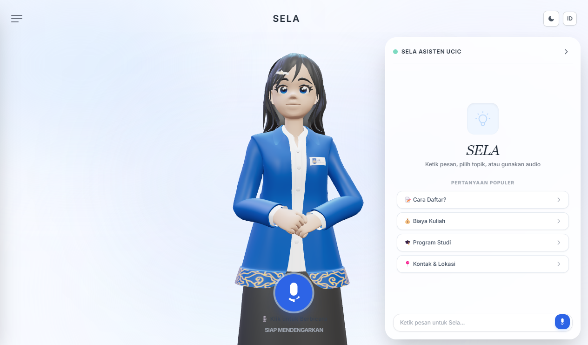

# Sela-AI-Desktop-App

SELA AI Desktop - AI Receptionist and Campus Customer Service UCIC.

## Tampilan



## Struktur
- `src/` - Frontend React + Vite
- `electron/` - Electron main process
- `ai-engine/` - Python backend (ASR streaming, LLM, TTS, RAG)
- `public/` - Aset statis
- `assets/3d-source/` - Sumber model 3D editable (tidak ikut bundel Vite)
- `docs/` - Tangkapan layar dan dokumentasi

## Cara jalan
```bat
launch_desktop.bat
```
atau
```powershell
.\launch_desktop.ps1
```

## Menguji

Satu perintah untuk seluruh uji asap (backend + frontend):

```powershell
$env:SELA_UJI_SERVER=1; py -3.12 ai-engine/test_server.py
```

- Bagian 1-13 dan 16-22 selalu jalan; bagian 14-15 (endpoint HTTP) hanya ikut bila
  `SELA_UJI_SERVER=1`.
- Bagian 22 menjalankan tes frontend `node:test`; bagian itu **dilewati dengan jelas**
  bila Node tidak ada di PATH, bukan dianggap gagal.
- Tes frontend juga bisa dijalankan sendiri: `npm test`.

Bila mengubah berkas di `src/`, bangun ulang `dist/` — `server.py` menyajikan folder itu,
jadi tanpa langkah ini aplikasi akan menyajikan antarmuka lama:

```bash
npm run build
```

## Mesin AI
| Bagian | Mesin | Keterangan |
| --- | --- | --- |
| Otak bahasa | Qwen3.5-4B (GGUF) | Offline, `enable_thinking: false` agar menjawab langsung |
| Suara (TTS) | **Supertonic 3** (ONNX) | 31 bahasa termasuk Indonesia, 10 tag ekspresi |
| Pendengaran (ASR) | **sherpa-onnx streaming zipformer** | Ucapan jadi teks **kata per kata** saat berbicara |
| Pencarian fakta | BM25 + gerbang cakupan IDF | Mesin utama RAG anti-halusinasi |
| Penguat makna | **multilingual-e5-small** (384 dim) | Opsional, memperkuat pencocokan parafrase |

## Model AI
Folder model (`models/`, `ai-engine/models/`) sengaja tidak di-push ke GitHub karena ukurannya besar.

Jalankan skrip persiapan model untuk mengunduh ulang:

```bash
py -3.12 ai-engine/persiapan_model.py --unduh-semua   # embedder + ASR + TTS
py -3.12 ai-engine/persiapan_model.py                 # cek kelengkapan saja
```

| Model | Ukuran | Perintah |
| --- | --- | --- |
| LLM Qwen3.5-4B GGUF | 2,8 GB | taruh manual di `ai-engine/models/` |
| TTS Supertonic 3 | 396 MB | `--unduh-tts` |
| ASR streaming zipformer | 340 MB | `--unduh-asr` |
| Embedder multilingual-e5-small | 493 MB | `--unduh-embedder` |

## Setelan lingkungan (opsional)

Semua nilai di bawah punya bawaan yang sudah terukur; nilai yang tidak sah otomatis
kembali ke bawaan.

### Suara (TTS)

| Variabel | Bawaan | Keterangan |
| --- | --- | --- |
| `SELA_TTS_SUARA` | `F1` | Gaya suara: `F1`-`F5` (perempuan), `M1`-`M5` (laki-laki) |
| `SELA_TTS_EMOSI` | `auto` | `auto` \| `on` \| `off`. `auto` hanya memasang tag ekspresi untuk en/ja/ko — tag Supertonic belum konsisten untuk Bahasa Indonesia |
| `SELA_TTS_STEPS` | `6` | Langkah difusi (4-16). Lebih sedikit = lebih cepat, tetapi amplitudo naik; **4 pernah melewati skala penuh** sehingga berisiko distorsi |
| `SELA_TTS_SPEED` | `1.15` | Pengali kecepatan bicara (0,5-2,0) |
| `SELA_TTS_JEDA` | `0.15` | Jeda antar potongan panjang dalam detik (0-1) |
| `SELA_TTS_UNDUH` | `1` | `0` melarang unduh model otomatis (dipakai saat aplikasi sudah dikemas offline) |

Kecepatan respons terukur pada tiga pertanyaan kampus (rata-rata, jeda dari teks
pertama sampai suara pertama): `SELA_TTS_STEPS=6` + `SELA_TTS_SPEED=1.15` memberi
**1.065 ms** (-22% dibanding setelan bawaan paket), dan `SELA_TTS_STEPS=5` memberi
**854 ms** (-38%) dengan amplitudo puncak 0,556 sehingga masih aman.

### Kecepatan jawaban (LLM)

Profil terukur pada mesin acuan (RTX 3050 6 GB lewat Vulkan, model 4B Q4_K_XL).
Seluruh 34 lapisan memang dijalankan di GPU, jadi angka decode di bawah adalah
batas perangkat, bukan salah setelan.

| Tahap | Terukur | Batasnya |
| --- | --- | --- |
| Routing + RAG | 17-57 ms | dapat diabaikan |
| Prefill prompt | 951 token/detik | panjang prompt |
| Decode jawaban | 39 token/detik | perangkat |
| Suara pertama | ~700 ms | langkah difusi TTS |

`llama-server` hanya menyimpan KV permintaan terakhir (`-np 1`), sehingga
pertanyaan **pertama** selalu paling lambat. Karena itu server memanaskan awalan
prompt di latar belakang begitu mesin siap: waktu ke token pertama pertanyaan
kampus pertama turun dari **2.147 ms menjadi 987 ms (-54%)**.

Diukur ujung-ke-ujung lewat `/ws/dupleks`, dari pertanyaan terkirim sampai suara pertama:
**±2,0 detik** pada giliran hangat dan ±2,6 detik bila ada riwayat obrolan. Giliran pertama
masih ±3,6 detik karena menanggung sisa prefill bagian dinamis. Yang menentukan pengalaman
adalah angka suara pertama itu, bukan total jawaban: setelah suara mulai, sisa jawaban
masih didekode di latar belakang sementara pengguna sudah mendengar kalimat pertama. Total
jawaban bisa 5-10 detik karena model kadang menulis lebih panjang daripada yang diminta
persona (satu kali terukur 12 kalimat), tetapi kalimat-kalimat itu mengalir berurutan.

Angka di atas adalah kondisi terbaik. Kecepatan mesin berubah-ubah cukup besar
(decode pernah terukur 39 token/detik, pernah juga 7-12 token/detik tanpa perubahan
kode), jadi sesekali ada giliran yang jauh lebih lambat. Konteks `-c 4096` sendiri
sudah memadai: percakapan lima giliran hanya memakai ~2.600 token.

### Jeda menunggu pengguna berhenti bicara

Ada satu komponen latensi yang bukan milik model, melainkan milik aturan endpointing
ASR: SELA baru mulai menyusun jawaban setelah mendengar `SELA_ASR_HENING2` detik hening
(bawaan 1,2 detik). Angka itu adalah **jeda mati yang selalu terbayar di setiap
giliran** — endpoint dihitung dari jumlah sampel hening, dan klien mengirim audio pada
kecepatan 1x, jadi satu detik hening berarti satu detik menunggu.

Nilai itu sekaligus menjadi toleransi terhadap jeda di tengah kalimat, sehingga
menurunkannya adalah pertukaran, bukan perbaikan gratis:

| `SELA_ASR_HENING2` | Jeda mati per giliran | Ucapan mulai terpotong bila jeda tengah kalimat melebihi |
| --- | --- | --- |
| `1.2` (bawaan) | 1,2 detik | 1,2 detik |
| `0.8` | 0,8 detik | 0,8 detik |

Bawaan 1,2 detik menjaga pengguna yang berpikir sejenak di tengah pertanyaan agar tidak
dipotong menjadi dua giliran. Bila kecepatan lebih penting daripada itu, `0.8` adalah
nilai bawaan sherpa-onnx sendiri dan menghemat 0,4 detik pada setiap giliran.

### Setelan `llama-server` yang sudah diuji dan ditolak

`-fa` (flash attention) dan `-ub` (ubatch) sempat dicurigai bisa mempercepat prefill.
A/B empat sesi server baru menunjukkan keduanya tidak layak dipakai:

| Setelan | Laju prefill | Token dinilai ulang | Waktu prefill nyata | Laju decode |
| --- | --- | --- | --- | --- |
| bawaan | 1.030 token/detik | 686 | **666 ms** | 40,4 token/detik |
| `-fa on` | 1.021 token/detik | 686 | 672 ms | 39,8 token/detik |
| `-ub 1024` | 1.157 token/detik | 1.198 | 1.035 ms | 40,9 token/detik |
| `-fa on -ub 1024` | 1.176 token/detik | 1.198 | 1.019 ms | 40,4 token/detik |

`-fa on` justru sedikit lebih lambat. `-ub 1024` memang menaikkan laju prefill, tetapi
**memotong pemakaian ulang KV cache** sehingga token yang harus dinilai ulang naik dari
686 menjadi 1.198 — dalam waktu nyata giliran itu lebih lambat. Setelan bawaan sudah
yang tercepat, dan jawaban keempat arm identik sehingga tidak ada alasan mutu untuk
berpindah.

### Mesin lain

| Variabel | Bawaan | Keterangan |
| --- | --- | --- |
| `PORT_SELA_AI` | `8008` | Port server AI lokal |
| `SELA_PYTHON` | otomatis | Paksa jalur interpreter Python tertentu |
| `SELA_LLM_PORT` | `8088` | Port internal `llama-server.exe` |
| `SELA_ASR_THREAD` | `2` | Jumlah utas ASR (naikkan bila CPU longgar) |
| `SELA_ASR_HENING1` | `2.0` | Hening (detik) untuk mengakhiri ucapan yang **belum** menghasilkan kata |
| `SELA_ASR_HENING2` | `1.2` | Hening (detik) untuk mengakhiri ucapan yang **sudah** menghasilkan kata |
| `SELA_ASR_MAKS_UCAPAN` | `20` | Batas panjang satu ucapan (detik) |
| `SELA_EMBEDDER_HF` | mati | `1` mengizinkan unduh embedder dari HuggingFace |
| `SELA_UJI_SERVER` | mati | `1` ikut menguji endpoint HTTP di `test_server.py` |
